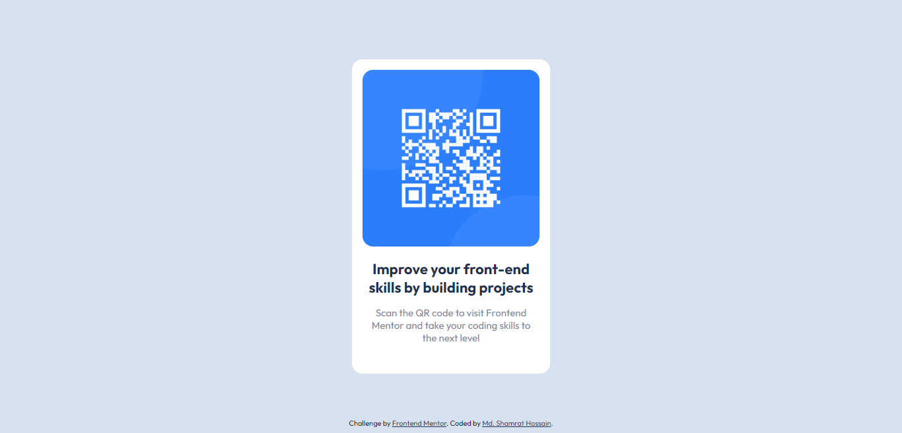

# Frontend Mentor - QR code component solution

This is a solution to the [QR code component challenge on Frontend Mentor](https://www.frontendmentor.io/challenges/qr-code-component-iux_sIO_H). 

## Table of contents

- [Overview](#overview)
  - [Screenshot](#screenshot)
  - [Links](#links)
- [My process](#my-process)
  - [Built with](#built-with)
  - [What I learned](#what-i-learned)
  - [Continued development](#continued-development)
  - [Useful resources](#useful-resources)
- [Author](#author)
- [Acknowledgments](#acknowledgments)


## Overview
This QR Code Component was a simple fun project. I used CSS variables, flexbox and some common CSS properties.

### Screenshot




### Links

- Solution URL: [Add solution URL here](https://github.com/shamratPG/QR-Code)
- Live Site URL: [Add live site URL here](https://shamratpg.github.io/QR-Code/)

## My process

### Built with

- Semantic HTML5 markup
- CSS custom properties
- Flexbox


### What I learned

Use this section to recap over some of your major learnings while working through this project. Writing these out and providing code samples of areas you want to highlight is a great way to reinforce your own knowledge.

To see how you can add code snippets, see below:

```html
<h1>Some HTML code I'm proud of</h1>
```
```css
.proud-of-this-css {
  color: papayawhip;
}
```

## Author

- Website - [Md. Shamrat Hossain](https://github.com/shamratPG)
- Frontend Mentor - [@@shamratPG](https://www.frontendmentor.io/profile/shamratPG)
- Twitter - [@shamratpg](https://twitter.com/shamratpg)

